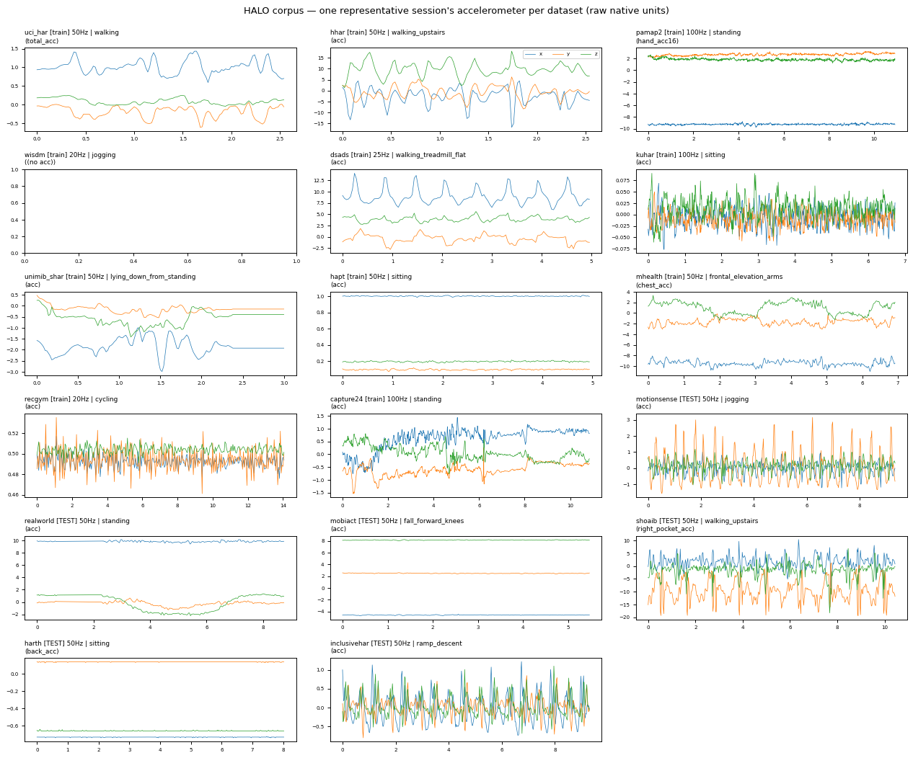

# HALO Data Sources — Catalog

Centralized reference for every dataset in the HALO benchmark: role, sensors, rates,
sizes, session-length distribution, and per-dataset data-quality caveats. Numbers are
computed from `benchmark_data/dataset_config.json` and the on-disk
`data/<ds>/sessions/*/data.parquet` files (see §5 to regenerate).

For **training-quantity depth** (hours trained, patches/epoch, session-cap policy) see
[`docs/v2/data_quantity_report.md`](v2/data_quantity_report.md). For the **standardized
per-session format** see [`DATA_FORMAT.md`](DATA_FORMAT.md).

## 1. At a glance

- **11 training datasets** + **6 held-out test datasets** (17 total).
- Train = the corpus HALO/baselines are fit on. Test = zero-shot / few-shot evaluation only.
- All sensor windows in the eval pipeline are resampled to a common grid
  (`benchmark_data/processed/limubert/<ds>`: 20 Hz, 6-ch acc+gyro; and
  `processed/ssl_wearables/<ds>`: 30 Hz, 3-ch acc, gravity-present datasets only).



*One median-length session's accelerometer per dataset, raw native units. The visibly different
regimes are the heterogeneity HALO must absorb — and expose data-quality issues at a glance: e.g.
`kuhar` is near-zero amplitude (gravity removed) and `recgym` sits flat around 0.5 (min-max
normalized). See §4 Caveats. (Regenerate: montage script; or `plot_sessions.py` for per-dataset QA.)*

## 2. Training datasets (11)

| Dataset | Native Hz | #Sessions (disk) | Sensors | #Activities | Session len s (min/med/max) | Placement |
|---|--:|--:|---|--:|---|---|
| uci_har     | 50  | 10,299  | acc(body+total)+gyro | 6  | 2.56 / 2.56 / 2.56 (fixed frame) | waist |
| hhar        | 50  | 47,961  | acc+gyro            | 6  | 2.56 / 2.56 / 2.56 (fixed frame) | waist/phone |
| pamap2      | 100 | 4,522   | acc+gyro+mag+HR+temp | 12 | 2.0 / 10.0 / 59.8 | hand/chest/ankle |
| wisdm       | 20  | 164,623 | phone+watch acc+gyro | 18 | 2.0 / 10.4 / 60.0 | phone + watch |
| dsads       | 25  | 9,120   | acc+gyro+mag        | 19 | 5.0 / 5.0 / 5.0 (fixed frame) | 5 body sites |
| kuhar       | 100 | 17,374  | acc+gyro            | 17 | 2.0 / 6.9 / 59.9 | waist |
| unimib_shar | 50  | 11,771  | acc only            | 17 | 3.02 / 3.02 / 3.02 (fixed frame) | pocket |
| hapt        | 50  | 2,546   | acc+gyro            | 12 | 1.5 / 5.3 / 19.4 | waist |
| mhealth     | 50  | 2,029   | acc+ecg+gyro+mag    | 12 | 2.0 / 8.2 / 19.8 | chest/ankle/arm |
| recgym      | 20  | 7,150   | acc+gyro            | 11 | 2.0 / 12.9 / 45.0 | wrist |
| capture24   | 100 | 48,518  | acc only (free-living) | 10 | 2.0 / 11.2 / 30.0 | wrist |

## 3. Test datasets (6, held out)

| Dataset | Native Hz | #Sessions (disk) | Sensors | #Activities | Session len s (min/med/max) | Placement / notes |
|---|--:|--:|---|--:|---|---|
| motionsense  | 50 | 7,989  | acc+gyro+gravity (iOS) | 6  | 2.0 / 8.8 / 20.0 | front pocket |
| realworld    | 50 | 16,830 | acc (7 body positions) | 8  | 2.0 / 9.1 / 29.9 | waist (+6 others) |
| mobiact      | 50 | 3,646  | acc+gyro               | 13 | 2.0 / 5.9 / 20.0 | trouser pocket |
| shoaib       | 50 | 3,438  | acc+gyro (5 positions) | 7  | 2.0 / 9.2 / 19.9 | multi-position |
| harth        | 50 | 37,941 | acc (back + thigh, Axivity) | 10 | 1.0 / 7.2 / 19.9 | back + thigh |
| inclusivehar | 50 | 2,049  | acc+gyro+gravity (iOS) | 6  | 2.0 / 9.1 / 29.9 | waist; **able-bodied vs disabled strata** (see `eval_inclusivehar_ability.py`) |

## 4. Per-dataset data-quality caveats (VERIFIED — load-bearing)

These affect physical-unit models (HALO's DC/gravity feature, ssl-wearables/harnet):

- **recgym — MIN-MAX NORMALIZED to [0,1]**: acc & gyro globally scaled to [0,1] per axis
  (all axes ~0.5, |acc|~0.866 const). Non-physical: no gravity magnitude/direction, physical
  amplitude destroyed. Corrupts HALO's signed DC/gravity feature. Excluded from ssl-wearables.
- **kuhar — GRAVITY-REMOVED (linear accel)**: static postures |acc|~0.05 (m/s²), no gravity
  channel to reconstruct. Excluded from ssl-wearables (harnet needs gravity).
- **unimib_shar — source subject-map (`acc_labels.npy`) LOST**: sessions load but session→subject
  mapping is unrecoverable, so raw per-subject CSVs can't be re-exported aligned to the eval grid.
  Excluded from ssl-wearables; needs a UniMiB-SHAR re-download to restore.
- **uci_har** stores BOTH `body_acc_*` (gravity-removed) AND `total_acc_*` (gravity-present g).
  Use `total_acc_*` when gravity is needed.
- **mhealth** gyro is degenerate on some channels (flagged honestly in its converter).
- **hhar/wisdm** disk session counts diverge from `dataset_config.json` (~2× overlap frames);
  hours overcount unique wall-clock ~2× for the fixed-frame UCI-family sets.

**ssl-wearables (harnet) trains on 8/11** train sets — excludes kuhar, recgym, unimib_shar
(non-physical / gravity-removed / source lost), logged loudly in `preprocess_ssl_wearables.py`.

## 5. Example session plots + regeneration

Per-dataset example-session plots are generated by:

```bash
python datascripts/shared/plot_sessions.py           # -> test_output/data_qa/<ds>_sessions.png
```

(Output lives under the gitignored `test_output/data_qa/`; regenerate as needed — one PNG per
dataset showing a representative session's channels.) The real-data sanity smoke to catch unit
bugs is `median|acc| ≈ 1 g` per dataset in `preprocess_ssl_wearables.py`.

## 6. Where these are configured

- `benchmark_data/dataset_config.json` — train/test lists, per-dataset channels + activities + rate.
- `datascripts/<ds>/convert.py` — the source→standardized converter (units/gravity/placement notes).
- `benchmark_data/scripts/{export_raw,preprocess_limubert,preprocess_ssl_wearables}.py` — eval-grid prep.
- Training quantity / caps: `training_scripts/human_activity_recognition/semantic_alignment_train.py`
  (`TRAIN_HOURS_PER_DATASET`, `MAX_SESSIONS_PER_DATASET`).
