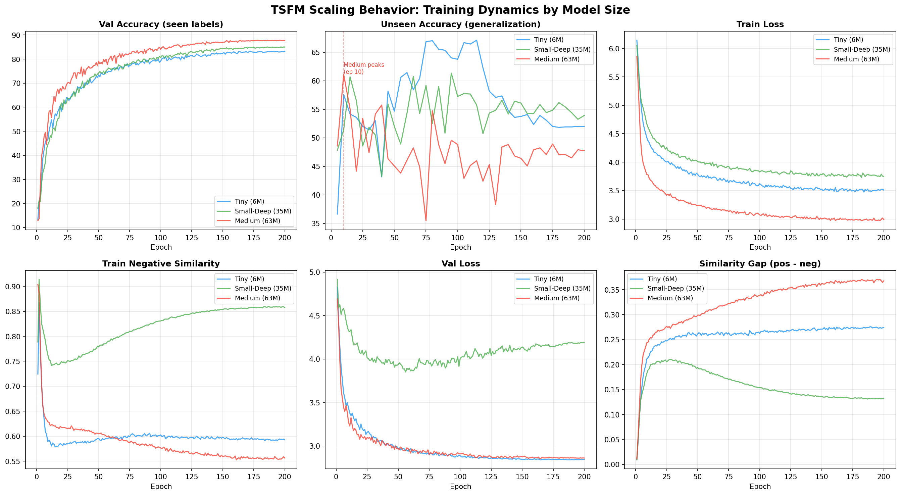
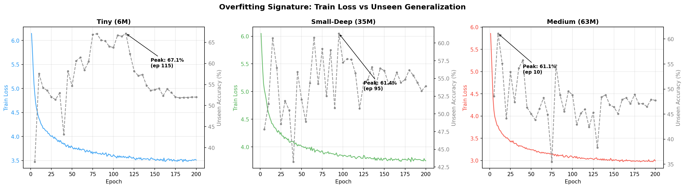
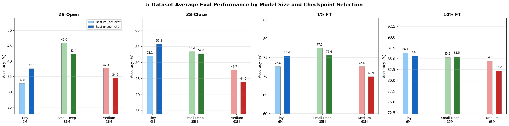

# TSFM Scaling Behavior Analysis

Our training dataset (~13K samples, 87 activity labels, ~10 sensor datasets) is small by foundation model standards. This document examines how model scaling interacts with this limited data regime.

## Models Tested

| Model | d_model | Layers | Trainable Params | Effective Batch | Negatives/step |
|-------|---------|--------|-----------------|-----------------|----------------|
| Tiny | 192 | 4 | ~6M | 512 | 767 (511 fresh + 256 queue) |
| Small-Deep | 384 | 8 | ~35M | 512 | 767 (511 fresh + 256 queue) |
| Medium | 512 | 8 | ~63M | 256 | 511 (255 fresh + 256 queue) |

All models trained for 200 epochs with InfoNCE loss, LR=1e-4, cosine schedule, memory bank size 256.

## Key Finding: Bigger Is Not Better

Scaling from 6M to 63M parameters produces **no improvement** on downstream evaluation. The largest model is the worst at zero-shot generalization.

### 5-Dataset Average Eval (best checkpoint per model)

| Model | ZS-Open Acc | ZS-Close Acc | 1% FT Acc | 10% FT Acc |
|-------|------------|-------------|-----------|------------|
| **Small-Deep (35M)** | **46.0** | **53.4** | **77.5** | **85.3** |
| Tiny (6M) | 32.8 | 52.1 | 72.6 | 86.4 |
| Medium (63M) | 37.8 | 47.7 | 72.6 | 84.5 |

Small-Deep is the sweet spot. Medium underperforms it by 8.2% on ZS-Open and 5.7% on ZS-Close. Tiny, despite being 6x smaller, matches or beats Medium on every metric and even leads at 10% FT.

## Training Dynamics

### Val accuracy is misleading

Medium achieves the **highest** val accuracy (87.8%) — better than Small-Deep (85.0%) and Tiny (83.3%). But val accuracy measures performance on the 87 training labels from the same sensor datasets. It rewards memorization of dataset-specific features, not generalizable representations.

### Unseen accuracy reveals the truth

The unseen accuracy metric (held-out activity labels) shows a completely different story:

| Model | Peak Unseen | Peak Epoch | Final (ep 200) |
|-------|------------|------------|----------------|
| Tiny (6M) | 67.1% | 115 | 52.0% |
| Small-Deep (35M) | 61.4% | 95 | 53.9% |
| Medium (63M) | 61.1% | **10** | 47.7% |

Medium's unseen accuracy peaks at **epoch 10** and never recovers. It spends 190 epochs getting better at memorizing training labels while getting worse at generalization. Tiny sustains high unseen accuracy until epoch 115 — its limited capacity forces it to learn transferable features.

## Why Medium Overfits

### 1. Negative similarity collapses too fast

The contrastive loss pushes negatives apart in embedding space. Medium accomplishes this almost immediately:

| Epoch | Medium neg_sim | Small-Deep neg_sim |
|-------|---------------|-------------------|
| 1 | 0.904 | 0.789 |
| 10 | **0.628** | 0.754 |
| 50 | 0.607 | 0.774 |
| 200 | 0.556 | 0.858 |

By epoch 10, Medium has pushed negatives to 0.628 and barely moves them afterward. The contrastive loss gradient for negatives is essentially zero — the model has "solved" the training task by finding surface-level features (sensor noise profiles, dataset artifacts, session characteristics) that separate the 87 training labels without capturing motion semantics.

Small-Deep's negatives actually **increase** over training (0.754 to 0.858), meaning classes get closer together and the model must find increasingly fine-grained semantic features to discriminate them. This is the healthy regime for contrastive learning.

### 2. Capacity-to-data ratio is too high

With 63M parameters and ~13K training samples, the model has ~4,800 parameters per sample. For comparison:
- CLIP was trained with 400M image-text pairs for ~400M parameters (~1 param/sample)
- Small-Deep has ~2,700 params/sample
- Tiny has ~460 params/sample

The Medium model has enough capacity to memorize dataset-level shortcuts without needing to discover generalizable motion representations.

### 3. No val loss divergence (deceptive)

| Model | Min val_loss | Final val_loss | Divergence |
|-------|-------------|---------------|------------|
| Medium | 2.856 (ep 165) | 2.860 | +0.004 |
| Small-Deep | 3.850 (ep 56) | 4.191 | +0.341 |
| Tiny | 2.839 (ep 165) | 2.842 | +0.003 |

Medium shows **zero** val loss divergence — a classic sign that the validation set shares the same distribution bias as training. The model memorizes dataset-specific features that work equally well on both splits. Small-Deep's val loss divergence is the honest signal that it's overfitting, but it retains better unseen generalization because it learned more transferable features before overfitting set in.

### 4. Projection dimension compounds the problem

Medium projects to 768-dim embedding space (matching SBERT directly) while Small-Deep and Tiny use 384-dim. The larger space gives more room to encode dataset-specific features that don't generalize. The 384-dim bottleneck acts as an implicit regularizer, forcing information compression.

## Checkpoint Selection Matters (But Doesn't Save Medium)

We evaluated each model at two checkpoints: best val_accuracy (default) and best unseen accuracy.

| Model | Checkpoint | ZS-Open | ZS-Close | 1% FT | 10% FT |
|-------|-----------|---------|----------|-------|--------|
| Tiny | best_val (ep172) | 32.8 | 52.1 | 72.6 | 86.4 |
| Tiny | best_unseen (ep115) | **37.6** | **55.8** | **75.4** | 85.7 |
| Small-Deep | best_val (ep186) | **46.0** | **53.4** | **77.5** | 85.3 |
| Small-Deep | best_unseen (ep95) | 42.4 | 52.8 | 75.6 | **85.5** |
| Medium | best_val (ep186) | **37.8** | **47.7** | **72.6** | **84.5** |
| Medium | best_unseen (ep10) | 34.6 | 44.0 | 69.9 | 82.2 |

- **Tiny benefits** from the unseen-peak checkpoint (+4.8% ZS-Open, +3.7% ZS-Close)
- **Small-Deep** is best at the default checkpoint (seen labels dominate the eval mix)
- **Medium at epoch 10** is worse everywhere — 10 epochs isn't enough training to learn good representations even though unseen accuracy happened to peak there

## Implications

1. **Don't scale the model without scaling the data.** Our ~13K samples support ~35M parameters (Small-Deep). Beyond that, extra capacity enables memorization without improving generalization.

2. **Val accuracy on seen labels is not a reliable proxy for generalization.** Medium has the best val accuracy (87.8%) but the worst eval performance. An unseen accuracy metric during training, if available, is more predictive.

3. **Contrastive learning amplifies the problem.** InfoNCE with a fixed number of negatives becomes "too easy" for large models — they can separate training classes using shortcuts rather than semantics. Scaling the model requires proportionally scaling the number of hard negatives (via larger batches or GradCache).

4. **Potential fixes for Medium** (untested): larger memory bank (256 to 1024+), lower learning rate (1e-4 to 5e-5), 384-dim projection bottleneck, higher dropout. These address the symptoms but the fundamental issue is dataset size.

---

*Analysis based on training runs from 2026-02-17 (tiny), 2026-03-03 (small_deep), and 2026-03-07 (medium). Eval averaged over MotionSense, RealWorld, MobiAct, Shoaib, Opportunity.*
