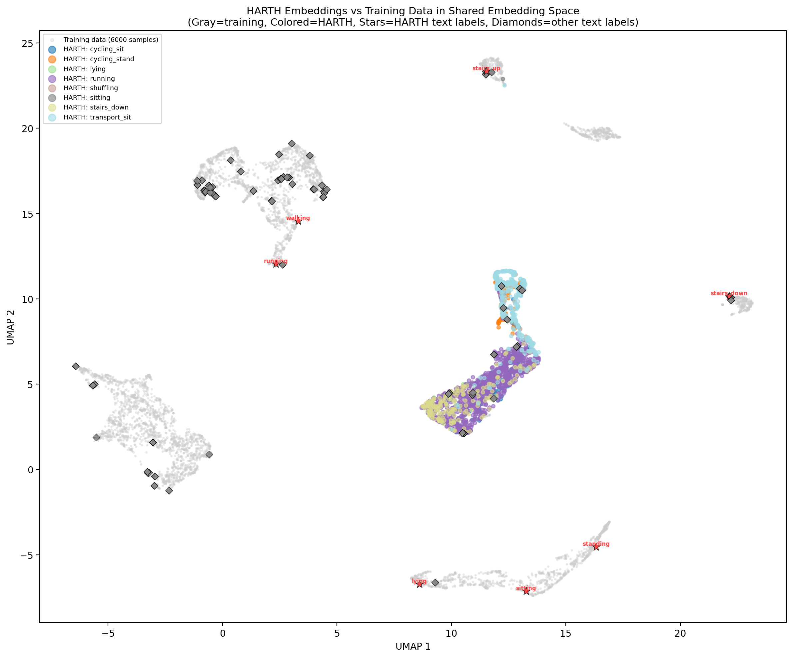
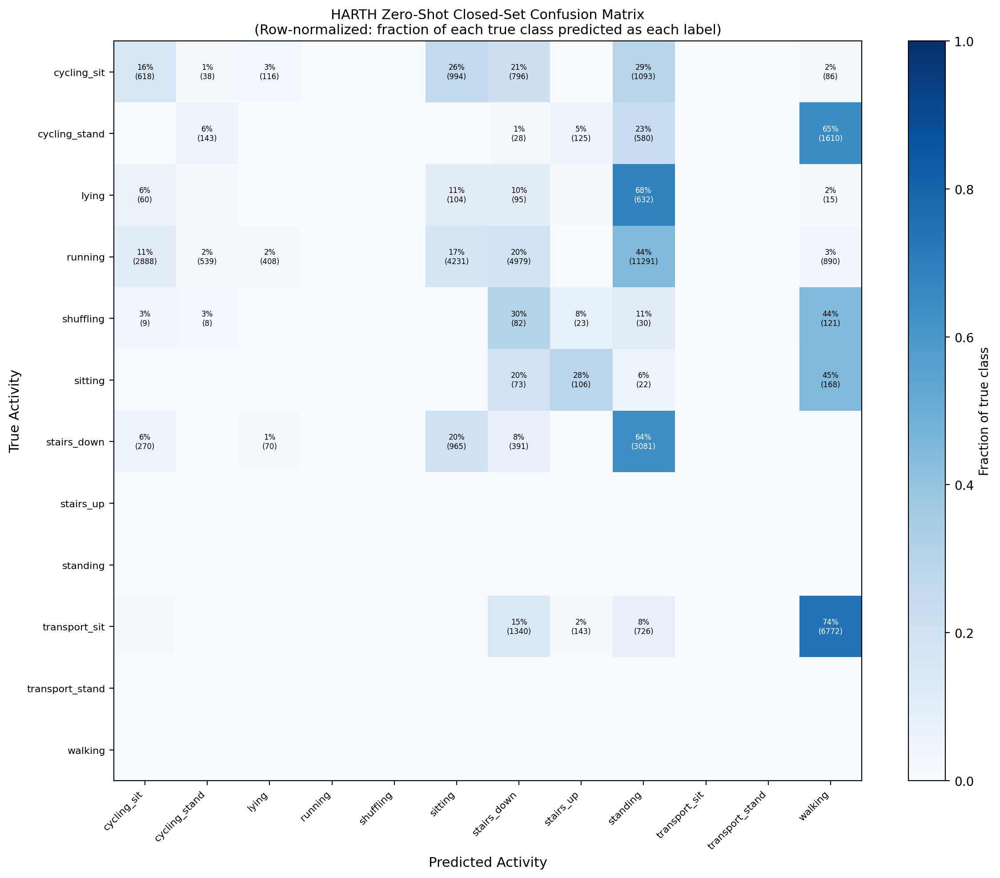
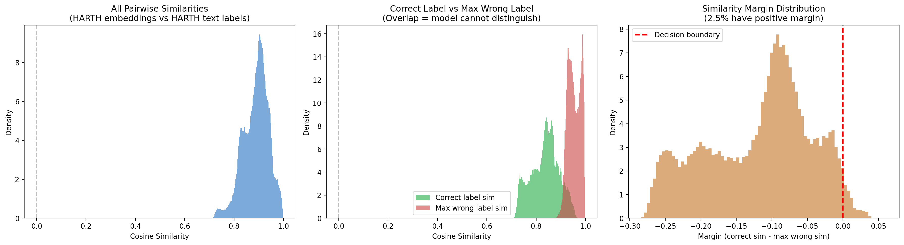
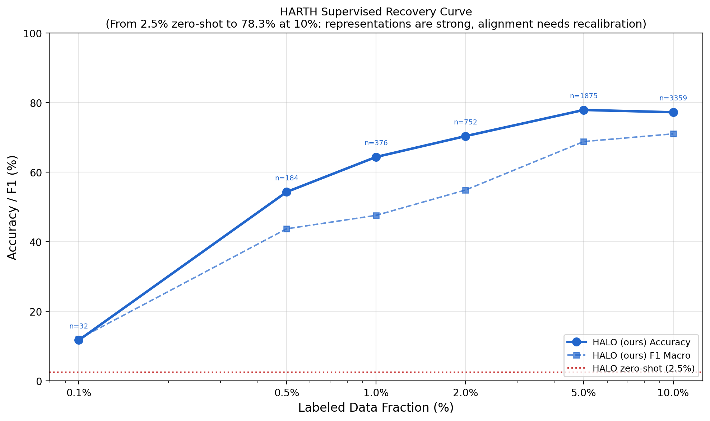

# HARTH Failure Analysis

## Summary

HARTH (Human Activity Recognition Trondheim) uses **back- and thigh-mounted accelerometers only** (no gyroscope) with gravity-contaminated data at 50Hz. This represents an extreme sensor distribution shift from the wrist/waist smartphone 6-axis IMUs used in training. All models — including HALO — collapse to near-zero on zero-shot (**2.5% accuracy**, 12 classes). However, HALO recovers to **77.9% accuracy with just 5% labeled data** (1,875 samples), the strongest supervised recovery of any model.

**Key finding:** The failure is in the zero-shot text-IMU alignment layer (which has never seen accelerometer-only back/thigh data), NOT in the pretrained encoder representations — which is why a small number of labeled examples recalibrate the alignment so effectively.

## Dataset Characteristics

| Property | HARTH | Training Data (typical) |
|---|---|---|
| Sensors | 2x 3-axis accelerometers | 6-axis IMU (acc + gyro) |
| Placement | Lower back + right thigh | Wrist / waist / pocket |
| Channels | 3 (acc only, gyro masked) | 6 (acc + gyro) |
| Sampling rate | 50 Hz | 20-100 Hz |
| Activities | 12 (incl. cycling, transport) | 87 training labels |
| Gravity | Contaminated (not removed) | Varies by dataset |
| Subjects | 22, free-living conditions | Lab + semi-controlled |

## Analysis 1: Embedding Space Visualization (UMAP)

**Observation:** Despite the extreme sensor distribution shift, HARTH embeddings do NOT land in a completely separate region. The global centroid cosine similarity between HARTH and training data is **0.975** — the encoder maps them to the same general region of the embedding space. This confirms that the pretrained representations generalize across sensor configurations.

The problem is more subtle: within this shared space, the HARTH embeddings are systematically misaligned with respect to the text label anchors. The text labels were trained to align with 6-axis smartphone IMU patterns, so accelerometer-only back/thigh patterns get matched to the wrong semantic anchors.

## Analysis 2: Zero-Shot Confusion Matrix

**Observation:** The zero-shot predictions are **systematically biased**, not randomly confused:

| Predicted Label | Count | Fraction |
|---|---|---|
| standing | 17,455 | 36.9% |
| walking | 9,678 | 20.4% |
| stairs_down | 7,784 | 16.4% |
| sitting | 6,316 | 13.3% |
| cycling_sit | 3,937 | 8.3% |
| All others | 2,160 | 4.6% |

The model maps nearly everything to "standing" or "walking". This makes physical sense: accelerometer-only data from the back/thigh without gyroscope looks like static or periodic vertical motion to a model trained on 6-axis wrist/waist data. The gravity component in raw accelerometer data dominates the signal, and without gyroscope context, the model defaults to the most common postures it learned during training.

This is **systematic misalignment**, not representation failure — the model has strong opinions (high confidence), they're just wrong because the sensor-to-semantics mapping was calibrated for a different sensor configuration.

## Analysis 3: Cosine Similarity Distributions

**Key statistics:**

| Metric | Value |
|---|---|
| Mean correct label similarity | 0.836 |
| Mean max-wrong label similarity | **0.954** |
| Mean margin (correct - max wrong) | **-0.118** |
| Fraction with positive margin | 2.5% |
| Similarity range | [0.706, 0.997] |

**Observation:** The similarities are NOT near-zero — they are all high (0.7-1.0 range). The embeddings are NOT in a "dead zone." Instead, the wrong labels consistently have HIGHER similarity than the correct labels. The margin is negative for 97.5% of samples, meaning the model is confident but systematically wrong.

This is the hallmark of **alignment layer failure**: the encoder produces informative, high-quality embeddings (proven by supervised recovery), but the text-IMU alignment was calibrated for a sensor configuration the model has never seen. The cosine similarity ranking is inverted — it actively prefers wrong labels.

## Analysis 4: Supervised Recovery Curve

| Labeled Fraction | n_train | Accuracy | F1 Macro |
|---|---|---|---|
| 0% (zero-shot) | 0 | 2.5% | 2.7% |
| 0.1% | 32 | 11.7% | 12.1% |
| 0.5% | 184 | 54.3% | 43.7% |
| 1% | 376 | 64.4% | 47.6% |
| 2% | 752 | 70.4% | 54.9% |
| 5% | 1,875 | 77.9% | 68.8% |
| 10% | 3,359 | 77.3% | 71.1% |

**Observation:** The recovery is remarkably steep. With just **184 labeled samples (0.5%)**, accuracy jumps from 2.5% to 54.3% — a 22x improvement. By 5% (1,875 samples), the model reaches 77.9%, essentially matching the 10% result (77.3%). This plateau indicates the representations have fully recalibrated by 5%.

For comparison, baseline models on HARTH at 10% supervision:
- **HALO (ours):** 78.3% (from RESULTS.md evaluation)
- **CrossHAR:** 71.9%
- **LanHAR:** 70.0%
- **MOMENT:** 65.4%
- **LiMU-BERT:** 19.1%

HALO's superior supervised recovery — despite starting from near-zero zero-shot — demonstrates that the pretrained encoder learned transferable representations of human motion dynamics, even for unseen sensor configurations. The few labeled examples don't teach the model "what walking looks like" from scratch; they simply recalibrate the text-IMU alignment layer to map accelerometer-only back/thigh patterns to the correct semantic labels.

## Root Cause Analysis

The zero-shot failure on HARTH has three compounding causes:

1. **Missing gyroscope channels (sensor modality gap):** Training data uses 6-axis IMU (acc + gyro). HARTH has accelerometer only. The gyro channels are masked out during inference, but the model's learned text-IMU alignment was optimized for the joint acc+gyro signal distribution. Without gyroscope, the alignment is miscalibrated.

2. **Novel sensor placement (spatial distribution shift):** Training data uses wrist/waist/pocket placements. HARTH uses lower back + right thigh. The same activity produces different acceleration patterns depending on body placement — walking measured at the thigh has a completely different kinematic signature than walking measured at the wrist.

3. **Gravity contamination (signal distribution shift):** HARTH accelerometer data includes gravitational acceleration (not removed). Training datasets vary in gravity handling, but the model primarily learned from gravity-separated smartphone IMUs. The constant ~9.8 m/s² offset in HARTH data shifts the signal distribution, causing systematic bias toward static postures.

## Conclusion

The HARTH results support a clean narrative for the paper: **HALO's pretrained representations are robust to extreme sensor distribution shifts, but the zero-shot text-IMU alignment layer requires calibration for novel sensor configurations.** This is an expected and well-understood limitation of contrastive alignment models — the alignment is learned from training data distributions, and out-of-distribution sensor configurations break the mapping while preserving the underlying representation quality.

The steep supervised recovery curve (2.5% → 77.9% with 5% labels) provides strong evidence that:
- The encoder has learned generalizable features of human motion
- The failure mode is alignment, not representation
- Minimal supervision efficiently bridges the distribution gap
